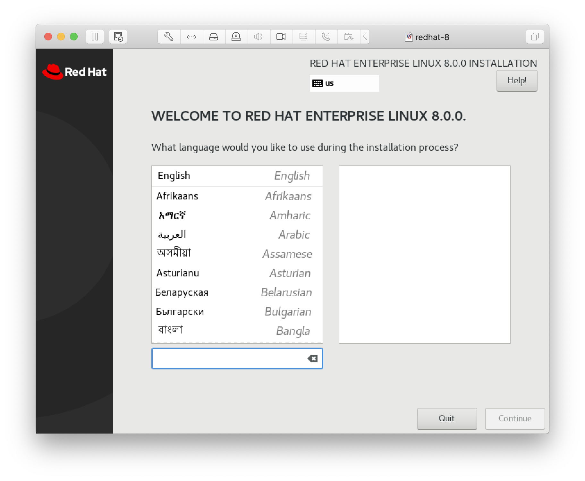
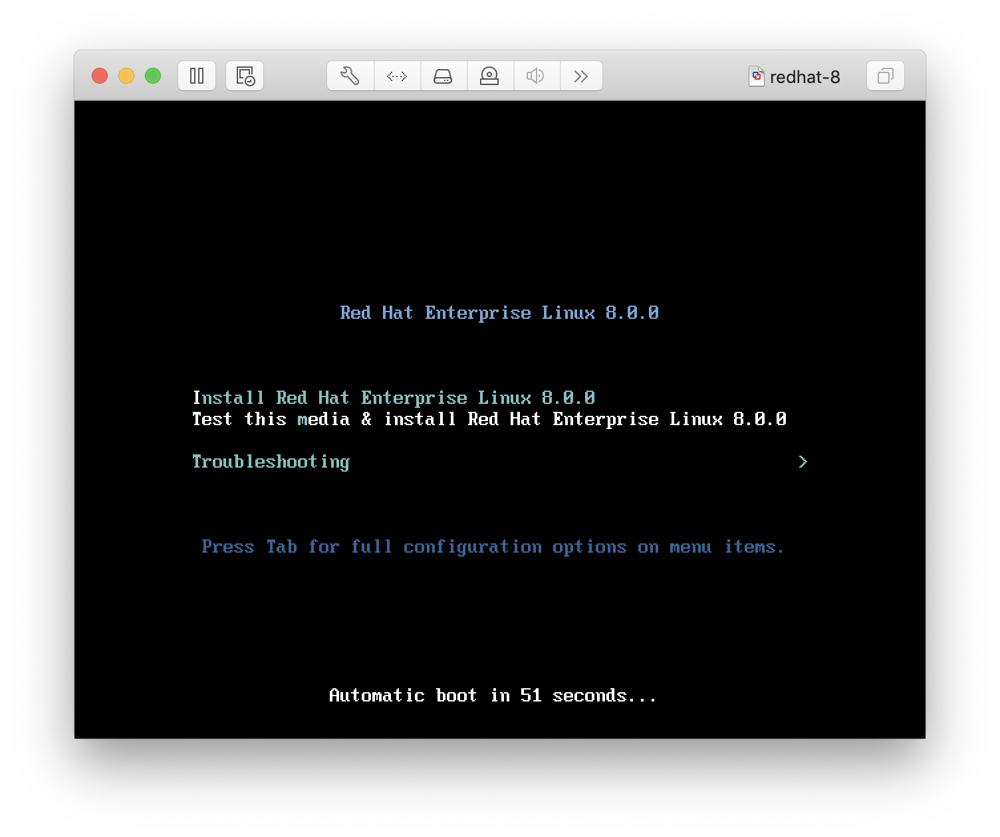
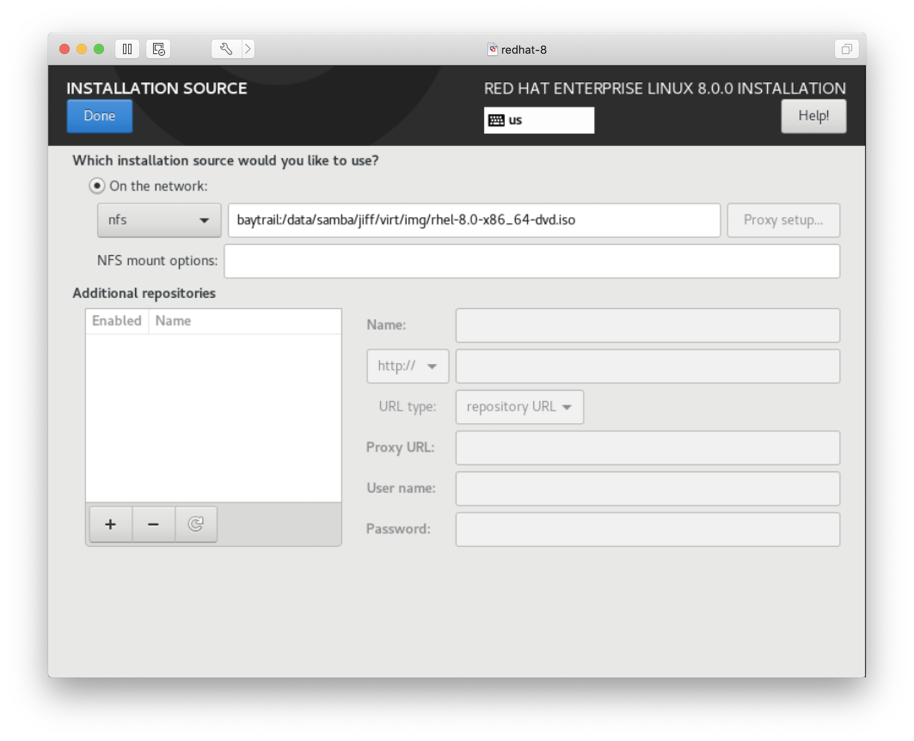
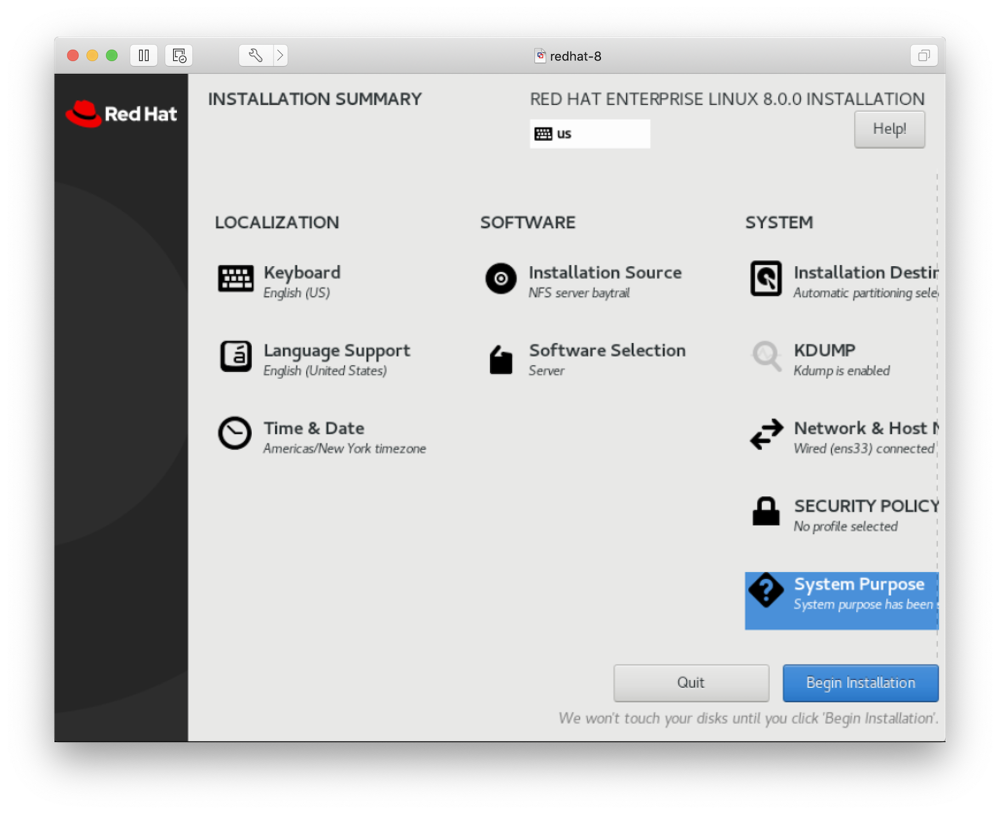
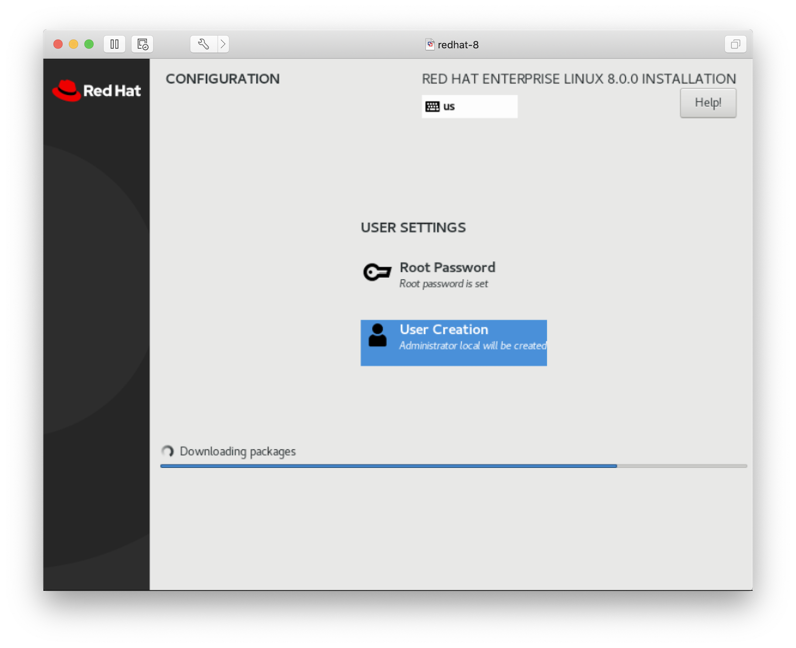
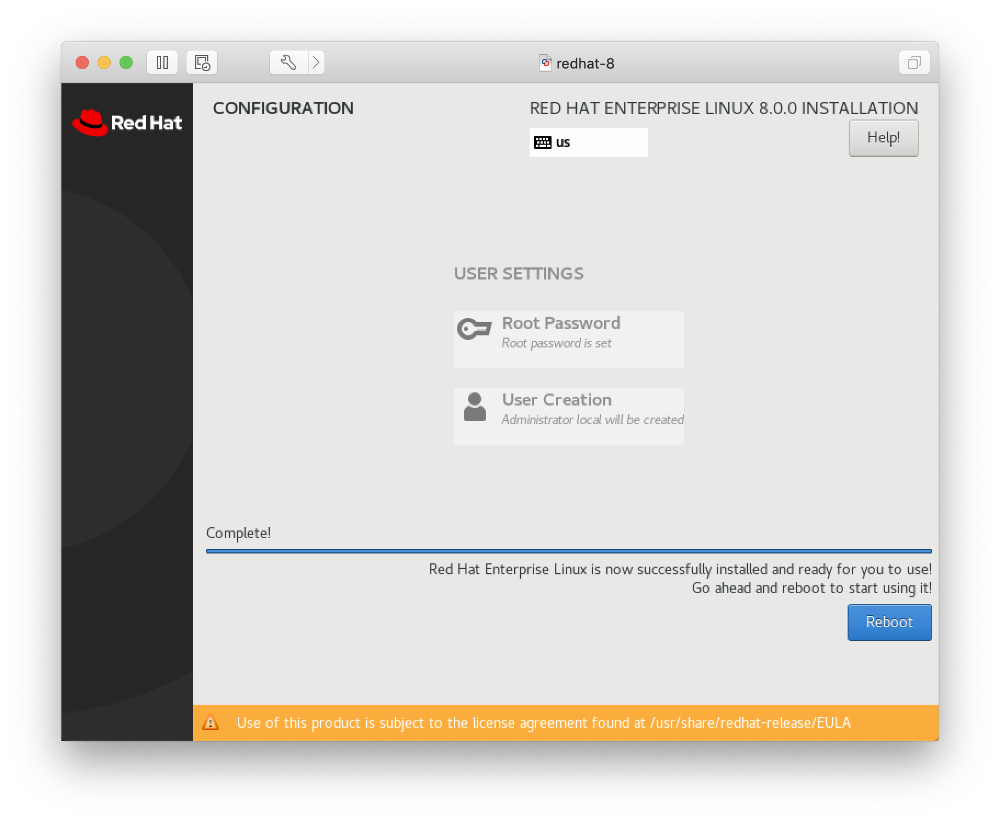
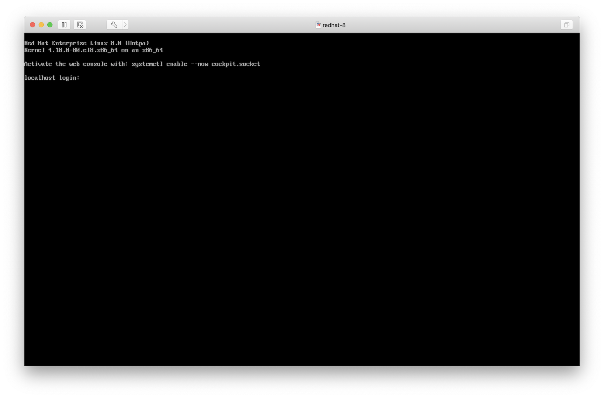

**Keywords: rhsca, preparation, exam, linux, system administrator**

If you're here then you must be preparing for the [Red Hat Certified System Administrator](https://www.redhat.com/en/services/training/ex200-red-hat-certified-system-administrator-rhcsa-exam) exam.  These are the notes I took prior to taking the exam.  It consists of many parts and once complete I'll include links to every page.

Please note that I haven't sat the exam yet so this document is a work in progress.

In this part, we'll walk through what will be covered in the exam and then install Red Hat Linux using the Developer free license.

# Exam overview
From the [official documentation](https://www.redhat.com/en/services/certification/rhcsa) you should be able to perform the following:
* Understand and use essential tools for handling files, directories, commandline environments, and documentation. *Essential tools*
* Operate running systems including booting into different run levels, identifying processes, starting and stopping virtual machines, and controlling services. *Operating running systems*
* Configure local storage using partitions and logical volumes. *Configure local storage*
* Create and configure file systems and file system attributes, such as permissions, encryption, access control lists, and network file systems. *Create and configure file systems*
* Deploy, configure, and maintain systems, including software installation, update and core services. *Deploy, configure, and maintain systems*
* Understand and use basic networking concepts. *Manage basic networking*
* Manage users and groups, including use of centralised directory for authentication. *Manage users and groups*
* Manage security, including basic firewall and SELinux configuration. *Manage security*

I've given a code name to each one.  But first, let's set up a development environment.

# In the wild
I didn't only want to take the exam to prove my Linux and system administrator chops; I also wanted to switch my career path from Product Management to System Adminstration, specifically in FinTech deployments.  So let's look at a few real job descriptions to see what we should add to the Task Requirements above.

For a job in Amsterdam
* Your technical knowledge and hands-on activities include solutions 
  * installation, implementation, and configuration of Linux environments
  * configuration and layout of virtualisation solutions
  * linking Linux environments to storage networks

For a job in the UK
* knowledge of Layer 2 and Layer 3 switches, including firewalls
* knowledge of RedHat administration
* knowledge of DHCP, DNS, TCP/IP, and other networking concepts
* experience of working with technologies such as Docker and Kubernetes within a containerised environment

From this we can see that network fundamentals are very important outside of what's already listed in the RHCSA exam requirements.

# Development environment
My preferred virtualisation solution is VMWare.  I'm sure these instructions also run on VirtualBox and Parallels, if on a Mac, and KVM in Linux.

We'll get started by registering for a [Red Hat Developer](https://developers.redhat.com) account.  This gives us a free evaluation license to download the latest Red Hat version.

Once you have signed up, you will also have an account at [Red Hat Access](https://access.redhat.com/).  Navigate there and go to Products & Servies > Red Hat Enterprise Linux.  Click on "Download version 8" and download the Boot ISO: Red Hat Enterprise Linux 8.0 Boot ISO.  You will also need to download the DVD "Red Hat Enterprise Linux 8.0 Binary DVD " and make it accessible somewhere on a network share.

Once you have the boot ISO downloaded, load it in your virtualisation product of choice and we can begin.

# Installing Red Hat
Set up a virtual machine and boot the installer.  I created a simple VM with 2 cores, 2568MB of RAM, and 20GB root drive.

Use the default settings.

You'll be prompted for the DVD location.  Enter it according to where you have it stored on your NFS share.

Everything else should have automatically been configured.  I selected [Base Environment]: Server and [Add-ons for Selected Environment]: File and Storage server.  Go ahead and begin the installation.

You'll have the opportunitity to creata a user account and root password.  Make sure the user account is an administrator.

Once the installation is complete, make a clone of the image as you'll need to create more of them later on in the exam preparation process.  Write down the user name you created as well as the password because you'll be referencing these frequently.

And now we're all logged in.  Part 2 will cover using essential system tools.