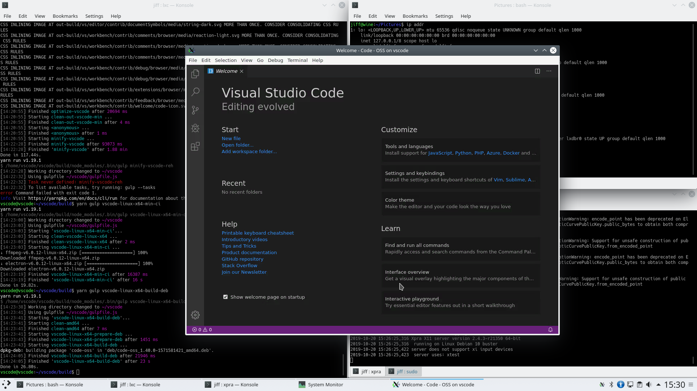

VSCode is pretty good multi-platform editor made by Microsoft that's available as a [snap](https://snapcraft.io/vscode).  Unfortunately, this snap is released under Microsoft's standard product EULA along with the builds available on their GitHub.  Fortunately, the source code is available under MIT license.  Here's how I built it.

The following work served as a great introduction to gulp, a JS build system, and yarn, a JS package manager.

You can either use LXD or [systemd-nspawn](https://www.freedesktop.org/software/systemd/man/systemd-nspawn.html) to create a container to build it.  Or you can build it locally if you already have yarn installed but I wanted to separate the two as I move to creating my build server in the near future.

I pulled a lot of build instructions from the [Azure Pipelines YAML](https://github.com/microsoft/vscode/blob/master/build/azure-pipelines/linux/product-build-linux.yml) file Microsoft uses to build the binary.

## Create and start container using LXD.
```
lxc init images:debian/buster/amd64 vscode
lxc start vscode
$ lxc exec vscode -- /bin/bash
```

## Install the latest yarn
```
# apt install gpg curl apt-transport-https lsb-release
# curl -Ss https://dl.yarnpkg.com/debian/pubkey.gpg | apt-key add -
# echo "deb https://dl.yarnpkg.com/debian/ stable main" | tee /etc/apt/sources.list.d/yarn.list
# apt update && apt install yarn
```

## Install the latest Node
```
# curl -Ss https://deb.nodesource.com/gpgkey/nodesource.gpg.key | apt-key add -
# echo "deb https://deb.nodesource.com/node_10.x buster main" | tee -a /etc/apt/sources.list.d/nodesource.list
# echo "deb-src https://deb.nodesource.com/node_10.x buster main" | tee -a /etc/apt/sources.list.d/nodesource.list
# apt update && apt install nodejs
```

## Install build tools
```
# apt install gcc g++ make 
```

## Install VSCode dependencies
```
# apt install git make pkg-config fakeroot libx11-dev libxkbfile-dev libsecret-1-dev libgtk-3-0 libasound2 libnotify4
```
## Clone and build VSCode as a local user
```
# adduser vscode
# su -l vscode
$ git clone https://github.com/Microsoft/vscode.git 
$ cd vscode/build
(increase max memory usage for Node) 
$ export NODE_OPTIONS="--max-old-space-size=4096"
$ yarn global add typescript gulp-yarn gulp-cli
$ yarn
$ yarn postinstall
$ yarn gulp
$ yarn gulp compile-build
$ yarn gulp compile-extensions-build
$ yarn gulp minify-vscode
$ yarn gulp vscode-linux-x64-min-ci
$ yarn gulp vscode-linux-x64-build-deb
# dpkg -i /home/vscode/vscode/.build/linux/deb/amd64/deb/code-*.deb

```
## Forward X11 socket to display on container host
This is probably the most difficult part as we'll need to present the running program on the local host.  I used a combination of the information available [here](https://github.com/bitsandsalsa/lxd_gui_container) and [here](https://blog.simos.info/how-to-run-graphics-accelerated-gui-apps-in-lxd-containers-on-your-ubuntu-desktop/) as a guide.

### Install X11 dependencies in the container
```
# apt install xorg xpra ssh
```

### Install X11 dependencies in the host
```
$ sudo apt install xpra
```

## Run VSCode - OSS version from the host
```
(get IP address of container from lxc ls)
$ xpra start ssh:vscode@<ip-address> --start=code-oss
```
## Success!


If you'd rather not follow through with these instructions, you can also install a prebuilt OSS version at [VSCodium](https://vscodium.com/).

### Addendum: gpg keys
For posterity's sake I'm including the GPG signatures so you can verify that you've imported the right ones.

```
## YARN
$ curl -Ss https://dl.yarnpkg.com/debian/pubkey.gpg | gpg --show-keys
pub   rsa4096 2016-10-05 [SC]
      72ECF46A56B4AD39C907BBB71646B01B86E50310
uid                      Yarn Packaging <yarn@dan.cx>
sub   rsa4096 2016-10-05 [E]
sub   rsa4096 2016-10-05 [S] [expired: 2017-10-05]
sub   rsa4096 2016-10-30 [S] [expired: 2019-01-01]
sub   rsa4096 2017-09-10 [S] [expired: 2019-01-01]
sub   rsa4096 2019-01-02 [S] [expires: 2020-02-02]
sub   rsa4096 2019-01-11 [S] [expires: 2020-02-02]

---
## NODESOURCE (NODEJS)
$ curl -Ss https://deb.nodesource.com/gpgkey/nodesource.gpg.key | gpg --show-keys
pub   rsa4096 2014-06-13 [SC]
      9FD3B784BC1C6FC31A8A0A1C1655A0AB68576280
uid                      NodeSource <gpg@nodesource.com>
sub   rsa4096 2014-06-13 [E]
```